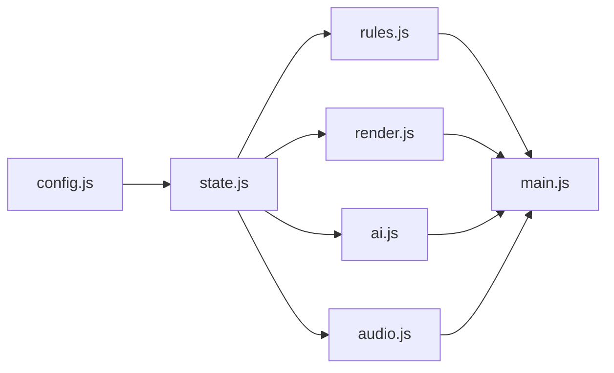
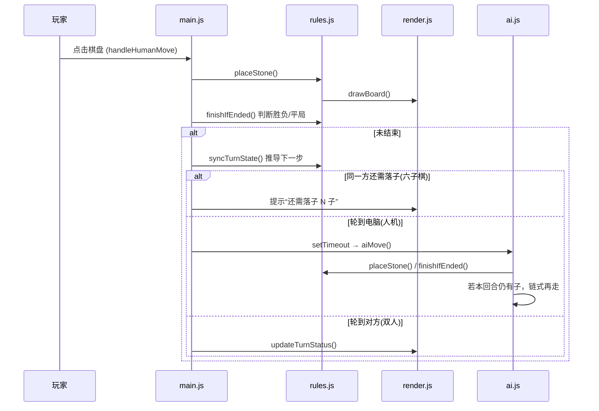

# 架构文档 · 森林小熊五子棋 / 六子棋

一个纯静态、可离线运行的网页棋类游戏。支持五子棋、六子棋、四子棋与三子棋，双人与人机对战，带音效与背景音乐。

---

## 1. 设计目标与约束

- **单机运行**：双击 `index.html` 即可在浏览器中离线游玩，无需构建步骤、无需服务器、无第三方依赖。
- **零依赖**：不引入任何框架或库，全部为原生 HTML/CSS/JavaScript。
- **原创素材**：小熊装饰为原创 SVG，背景音乐为 Web Audio 实时合成，均不含受版权保护的素材。

> 因为要保留“双击直接打开”，代码采用**传统 `<script>` 脚本**（非 ES module）。所有脚本共享全局作用域，通过加载顺序解决依赖。

---

## 2. 目录结构

```
Chess/
├─ index.html          页面结构 + 控件；按顺序加载 js/ 下脚本
├─ styles.css          森林卡通风样式、动画、庆祝特效
├─ assets/
│  ├─ bear-left.svg     原创小熊装饰
│  └─ bear-right.svg    原创小熊装饰
├─ js/
│  ├─ config.js        常量、音乐乐谱、AI 难度表
│  ├─ state.js         DOM 引用 + 全局可变状态
│  ├─ rules.js         棋盘/回合/胜负规则
│  ├─ render.js        canvas 绘制 + 状态栏 + 庆祝特效
│  ├─ ai.js            AI 评估与选点
│  ├─ audio.js         音效 + 背景音乐合成
│  └─ main.js          流程编排 + 事件绑定 + 初始化
├─ README.md
└─ ARCHITECTURE.md     本文档
```

---

## 3. 模块职责

| 模块 | 职责 | 关键成员 |
|------|------|---------|
| `config.js` | 只读常量与配置数据 | `EMPTY/BLACK/WHITE` `BGM_SCORES` `difficultyConfig` |
| `state.js` | DOM 元素引用 + 所有可变全局状态 | `board` `boardRows`/`boardCols` `currentPlayer` `gameType` `winLength` `stonesLeftThisTurn` `moveHistory` `bgm*` 等 |
| `rules.js` | 棋局规则与回合推导 | `createBoard` `gravityDropRow` `deriveTurnState` `isFreshTurnStart` `syncTurnState` `resetGame` `placeStone` `hasWin` `finishIfEnded` `findThreats` |
| `render.js` | 画面与文字反馈 | `drawBoard` `drawConnect4Board` `drawTicTacToeBoard` `drawDisc` `gridGeometry` `getBoardPosition` `getGridCell` `resizeBoard` `updateStatus` `showCelebration` `showDraw` `drawThreats` |
| `ai.js` | 电脑走子（简单启发式） | `chooseAiMove` `chooseConnect4Move` `aiMove` `evaluatePoint` `evaluatePotentialFork` `findInstantWinMove` `scorePattern` |
| `audio.js` | 声音合成 | `ensureAudioContext` `playSound` `playTone(At)` `playBgmLayers` `playBgmStep` `startBgm` `stopBgm` `restartBgm` |
| `main.js` | 用户交互与生命周期 | `handleHumanMove` `undoMove` + 事件监听 + 初始化 |

---

## 4. 加载顺序（重要）

由于共享全局作用域，`index.html` 中脚本顺序**不可打乱**：

```
config.js → state.js → rules.js → render.js → ai.js → audio.js → main.js
```

- `config.js` 最先：定义所有常量。
- `state.js` 其次：引用常量与 DOM。
- 中间四个（rules/render/ai/audio）只**声明函数**，彼此调用在运行时才发生，相互顺序无所谓。
- `main.js` 最后：绑定事件并执行初始化。



### 约定
- 每个顶层标识符（`const`/`let`/`function`）**只声明一次**；跨文件重复声明会抛 `Identifier already declared`。
- 初始化时必须**先 `board = createBoard()` 再 `resizeBoard()`**，否则 `drawBoard` 会读到空数组而崩溃。

---

## 5. 核心数据模型

- `board`：`boardRows × boardCols` 的二维数组，元素为 `EMPTY / BLACK / WHITE`。
- `moveHistory`：落子记录数组 `{ row, col, player }`，用于悔棋与回合推导。
- `currentPlayer` / `stonesLeftThisTurn`：当前该谁落子、本回合还剩几子。

---

## 6. 三种棋的统一与差异

三种棋**共用同一套核心**，主要由棋盘尺寸、`winLength` 与落子方式区分：

| 维度 | 五子棋 | 六子棋 | 四子棋 |
|------|--------|--------|--------|
| 棋盘 (`boardRows`×`boardCols`) | 15×15 | 19×19 | 6×7 |
| 落子方式 | 交叉点任意落子 | 交叉点任意落子 | 选列、重力落底 |
| 星位 | 5 个（四角 + 中心） | 9 个（标准 hoshi） | 无（填格棋盘） |
| `winLength` | 5 | 6 | 4 |
| 每回合子数 | 恒为 1 | 首手 1 子，其后每回合 2 子 | 恒为 1 |

回合节奏由 `deriveTurnState(n)` 纯函数推导（`n` = 已落子数），返回 `{ player, stonesLeft }`。悔棋、切换、状态提示都基于它，避免手工维护回合计数出错。棋盘尺寸 `boardRows`/`boardCols`、`winLength` 与标题在 `resetGame()` 中随棋种同步更新。四子棋的落点由 `gravityDropRow(col)` 计算（该列最底部空格），胜负仍用通用的 `hasWin`。

此外还有**三子棋**：3×3、连 3、任意空格落子（与四子棋同为格子棋盘，用 `gridGeometry`/`getGridCell` 处理，但无重力），棋盘画法为 `drawTicTacToeBoard`（网格线 + 落格棋子）。

- 六子棋回合边界：黑起手在 `n = 0`，之后 2 子回合的黑方新回合在 `n = 3, 7, 11, …`。
- `isFreshTurnStart(n)` 判断某点是否为“某方一个完整回合的起点”，供悔棋回退到玩家整回合之前。

---

## 7. 一步棋的流程



---

## 8. AI 设计（第一版·简单启发式）

`chooseAiMove()` 的决策优先级：

1. **能赢就赢**：`findInstantWinMove(WHITE)` —— 落一子即可连成 `winLength`。
2. **必挡就挡**：`findInstantWinMove(BLACK)` —— 对手一子即将获胜则拦截。
3. **打分选点**：对每个空点综合评估
   - `evaluatePoint`：己方进攻价值 + 对方威胁价值（按连子数/活口用 `scorePattern` 计分）。
   - `evaluatePotentialFork`：是否形成双威胁（fork）。
   - `centerBias`：靠中心加分。
   - 难度噪声：`difficultyConfig` 控制随机性与候选池大小（简单更随机，困难更稳）。

六子棋下，AI 每回合的 2 子由 `aiMove()` **逐子链式**完成（每子间有短延时便于观察），每落一子后重新评估。四子棋由 `chooseConnect4Move()` 处理：只在每列的重力落点中选择，同样先做「能赢/必挡」判断，再按进攻/防守/居中打分。

> 说明：即时拦截仅覆盖“单子致胜”。六子棋中需要两子完成的复杂威胁、四子棋的多步陷阱尚未处理，属后续增强点。

---

## 9. 音频设计

全部由 Web Audio API 实时合成，无音频文件：

- **音效** `playSound(kind, player)`：落子/悔棋/胜利/平局的短音。
- **背景音乐** `BGM_SCORES` + `playBgmStep()`：按乐谱逐拍播放，`playBgmLayers` 分三层（主旋律 lead / 和弦铺底 pad / 低音 bass）。
  - 风格：`happy` `calm` `tense` `eerie` `horror`，各有独立乐段与音色（如 horror 用锯齿波 + 低频不协和）。
  - 受浏览器自动播放限制，首次用户交互后才启动（`document` 上一次性 `click` 监听 + 各开关触发 `ensureAudioContext`）。

---

## 10. 渲染

- 单个 `<canvas>` 全量重绘：`drawBoard()` 画网格、星位（15×15 为四角 + 中心共 5 个；19×19 为标准 9 个）、所有棋子，以及最近一回合落子的闪烁高亮（六子棋会同时闪 2 子）。
- `setInterval` 每 420ms 翻转 `blinkOn` 实现“上一手”闪动。
- **危险棋型提示**（默认开，`#threatToggle` / 全局 `threatHighlightEnabled`）：`findThreats()`(rules.js) 用滑窗扫描双方“必须要堵”的棋型，返回 `{player, level, cells, gains}`；`drawThreats()`(render.js) 高亮：
  - **critical**（对手下一回合就能赢，必堵）——长度 `winLength` 的窗内无对方子、空点数 ≤ `stonesPerTurn` 且都**可落**，只给这些**棋子**画红色发光圈（不标空位，避免信息过多）。`stonesPerTurn` 单子棋种为 1（差 1 子的冲四/连三/连二），**六子棋为 2**（一回合下 2 子，故连四“差 2 子”也算必堵——不堵下一手补 2 子直接连 6；空点用 `isPlayableCell` 校验，四子棋判重力）。
  - **danger**（真·活三：不堵下一手就成活四）——长度 `winLength+1` 的窗、**两端皆空**、含 `winLength-2` 子，画醒目橙色圈。两端皆空是关键：眠三 / 被夹的三（只能成冲四）不会误报。仅在 `winLength >= 5` 时检测（主要是五子棋活三；六子棋的活四已被 critical 覆盖）。
  - 落子/悔棋/切换/开关时经 `refreshThreats()` 重算并存入全局 `threats`，脉冲复用 `blinkOn`；被 critical 覆盖的子不再叠 danger 橙圈，胜负或关闭时不绘制。
- `resizeBoard()` 按棋种设定画布分辨率（15×15 → 540px，19×19 → 660px），并重算 `cellSize`；CSS 用 `max-width: 100%` + `aspect-ratio` 在小屏上等比缩放，不溢出。
- 胜负时 `showCelebration()` 叠加彩带 + 发光横幅（CSS 动画）。

---

## 11. 如何扩展（改动落点）

| 想做的事 | 该改哪里 |
|----------|---------|
| 调整 AI 强弱/策略 | `js/ai.js`（必要时 `difficultyConfig` in `config.js`） |
| 新增/修改背景音乐 | `config.js` 的 `BGM_SCORES` + 必要时 `audio.js` |
| 改棋盘/棋子/特效外观 | `js/render.js` + `styles.css` |
| 调整危险棋型提示 | `js/rules.js`（`findThreats` 检测规则）+ `js/render.js`（`drawThreats` 绘制样式） |
| 加新规则或棋种 | `js/rules.js`（优先复用 `winLength`/`deriveTurnState`，勿按棋种拆文件） |
| 加控件/交互 | `index.html` + `js/main.js`（事件绑定） |
| 新增全局状态 | `js/state.js` |

---

## 12. Git 协作约定

- `main` 受保护：改动走 PR（当前所需审批数为 0，仓库已开启 Auto-merge）。
- 常用流程：新建 `feat/*` 分支 → commit → push → `gh pr create` → `gh pr merge --merge --delete-branch` → 切回 `main` `pull` → 删除本地分支。
